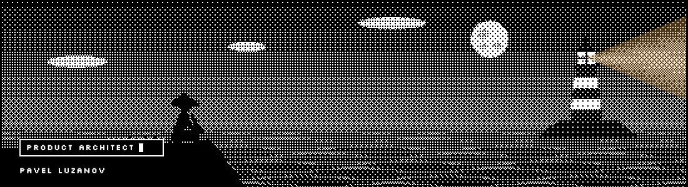

# Hi there, I'm Pavel Luzanov 👋

  

<a href="assets/lighthouse-banner.png">View a static version</a>

  
  

## About Me

I'm a Tech Lead and staff-level product engineer based in Tokyo, Japan. I started in frontend engineering and now work across product architecture, technical strategy, engineering practices, and AI-augmented delivery.

- 🔭 Turning ambiguous business problems into scoped technical plans and shipped systems
- 🧭 Focused on frontend architecture, UI standardization, developer experience, and engineering culture
- 🤖 Building agentic workflows for implementation, review, and cross-domain delivery
- 💬 Ask me about React, TypeScript, system design, frontend architecture, or engineering practices
- 🌍 Open to senior, staff, and tech-lead roles with relocation in Europe or North America
- 📫 How to reach me: [arklogin@gmail.com](mailto:arklogin@gmail.com)

## Connect with Me

  
  
  

## Featured Projects

  <table>
    <tr>
      <td align="center">
        <a href="https://github.com/gitpash/agent-artifact-protocol" target="_blank">
          <strong>agent-artifact-protocol</strong>
        </a>
         
        Git-native filesystem convention for agent repo orientation
      </td>
      <td align="center">
        <a href="https://github.com/gitpash/distractor-lab" target="_blank">
          <strong>distractor-lab</strong>
        </a>
         
        Svelte experiment
      </td>
    </tr>
    <tr>
      <td align="center">
        <a href="https://github.com/gitpash/tg-memory-core" target="_blank">
          <strong>tg-memory-core</strong>
        </a>
         
        TypeScript project
      </td>
      <td align="center">
        <a href="https://github.com/gitpash/deno-playground" target="_blank">
          <strong>deno-playground</strong>
        </a>
         
        Deno experiments
      </td>
    </tr>
  </table>

## GitHub Stats

  
   
  

## Languages & Tools

  
  
  
  
  
  

---

  Built with ❤️ by <a href="https://github.com/gitpash" target="_blank">Pavel Luzanov</a>

